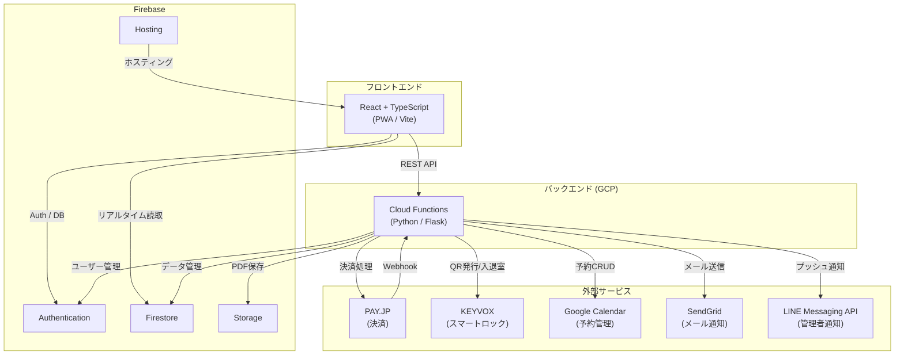

# 📋 ポートフォリオ

## 👤 自己紹介

**R.H** ｜ フルスタックエンジニア / スクラムマスター

ITエンジニアとして20年以上の経験を持ち、**組み込みソフトウェア開発からモダンWeb開発**まで幅広い領域をカバーしています。

キャリア前半はデジタルカメラ・監視カメラ等の組み込みソフトウェア開発でチームを率いるプロジェクトマネージャー兼テックリードとして従事。C言語やリアルタイムOS（μITRON）で培った**低レイヤーの設計力**を基盤に、近年はReact / TypeScript / Python によるモダンWeb開発をプレイングマネージャーとして主導しています。

### 得意領域

| カテゴリ                 | スキル・経験                                                                                |
| ------------------------ | ------------------------------------------------------------------------------------------- |
| **モダン開発 (Web/App)** | React, TypeScript, Next.js, Node.js, Python, Flutter, Dart                                  |
| **インフラ・クラウド**   | Firebase (Authentication, Firestore, Cloud Functions, Hosting), GCP                         |
| **AI・最新技術**         | GitHub Copilot（カスタムエージェント開発、Skills作成）、生成AIを活用した開発効率化          |
| **外部サービス連携**     | PAY.JP（決済）, KEYVOX（スマートロック）, Google Calendar API, SendGrid, LINE Messaging API |
| **マネジメント**         | スクラムマスター（Scrum of Scrums）, PMP知見に基づく要件定義・工数管理                      |
| **基礎技術**             | C言語, Linux, μITRON, ARM, メモリ/パフォーマンスチューニング                                |

### 保有資格

| 資格                                           |
| ---------------------------------------------- |
| Project Management Professional（PMP）— Active |
| 認定スクラムマスター（RSM）                    |
| JSTQB認定テスト技術者                          |
| 基本情報技術者                                 |
| 日商簿記検定2級                                |

---

## 🎯 プロジェクト: フィットネスクラブ会員予約・入退室管理システム

### 📌 プロジェクト概要

24時間無人運営のフィットネスクラブ（複数店舗）向けに、**入会予約から決済、QRコードによる入退室管理**までを一気通貫で行うWebシステムを開発しました。

> 🌐 **デモサイト（ステージング環境）:** https://d-fit24-receptionist-staging.web.app/

### 🔍 背景と課題

| 課題                                                       | 解決策                                            |
| ---------------------------------------------------------- | ------------------------------------------------- |
| 24時間無人運営のため、スタッフ不在時に入会手続きができない | Webからの入会予約フォーム＋オンライン決済で完結   |
| 物理カード発行のコスト・管理負荷                           | スマートロック（KEYVOX）連携によるQRコード入退室  |
| 複数店舗・ゴルフシミュレーターの予約管理                   | Google Calendar APIを活用した統合予約管理         |
| 決済失敗時の対応が手動で煩雑                               | PAY.JP Webhookによる自動検知・通知                |
| 会員・スタッフへの連絡手段がバラバラ                       | SendGrid（メール）+ LINE Messaging API の統合通知 |

---

### 🏗️ システム構成図

---

### 🔧 主な機能

#### 会員向け機能

| 機能                            | 説明                                                         |
| ------------------------------- | ------------------------------------------------------------ |
| 📝 **入会予約**                 | Web上での入会手続き（プラン選択・日時予約・個人情報入力）    |
| 💳 **オンライン決済**           | PAY.JP連携によるクレジットカード決済・サブスクリプション管理 |
| 🚪 **QRコード入退室**           | スマートロック（KEYVOX）連携による非接触入退室               |
| 📱 **マイページ**               | 登録情報確認・メール変更・パスワード変更                     |
| 🏌️ **ゴルフシミュレーター予約** | 空き状況確認・予約・QRコード発行                             |
| 👀 **見学・無料体験予約**       | 30分単位のタイムスロット予約                                 |

#### 管理者向け機能

| 機能                | 説明                                                  |
| ------------------- | ----------------------------------------------------- |
| ✅ **入会承認管理** | 新規入会申請の確認・承認・契約PDF自動生成             |
| 👥 **会員情報管理** | 会員一覧・詳細表示・ステータス管理・CSV一括インポート |
| 📊 **入退室履歴**   | リアルタイムの入退室ログ・現在入室者一覧              |
| 💰 **決済管理**     | 請求一覧・決済失敗者管理・サブスクリプション管理      |
| 🗓️ **予約管理**     | Google Calendar連携による予約確認・管理               |
| 🔐 **スタッフ管理** | スタッフ登録・招待メール・QRコード発行                |
| 🗄️ **ロッカー管理** | 物理ロッカーの割り当て・解除                          |

#### その他

| 機能                            | 説明                                                          |
| ------------------------------- | ------------------------------------------------------------- |
| 🏪 **マルチ店舗対応**           | 複数店舗を1つのコードベースで運用（店舗ごとの設定分離）       |
| 👤 **ロールベースアクセス制御** | 会員・管理者・スタッフ・ビジターの4つのロール                 |
| 📄 **契約PDF自動生成**          | 入会時・プラン変更時にPDFを自動生成し、Firebase Storageに保存 |
| 🔔 **マルチチャネル通知**       | メール（SendGrid）+ LINE（管理者通知）の二重通知              |
| 🔄 **Webhook処理**              | PAY.JPの30種以上のイベントを自動処理                          |
| 📲 **PWA対応**                  | iOS/Androidでアプリのようにインストール・オフライン対応       |

---

### 🛠️ 技術スタック

#### フロントエンド

| 技術                  | バージョン | 選定理由                                                     |
| --------------------- | ---------- | ------------------------------------------------------------ |
| **React**             | 18         | コンポーネントベースのUI構築、豊富なエコシステム             |
| **TypeScript**        | 5          | 型安全性による大規模アプリの品質担保                         |
| **Vite**              | 5          | 高速なビルド・HMRによる開発体験向上                          |
| **Material UI (MUI)** | 5          | 統一されたデザインシステム、業務アプリとの相性               |
| **React Router**      | 6          | SPA内のルーティング・ロールベースのルートガード              |
| **FullCalendar**      | 6          | 予約カレンダーの視覚的表示                                   |
| **Formik + Yup**      | -          | フォームバリデーション（入会フォーム等の複雑なフォーム管理） |
| **Vite PWA Plugin**   | -          | Service Worker・オフライン対応・インストール可能なアプリ化   |

#### バックエンド

| 技術                           | バージョン | 選定理由                                     |
| ------------------------------ | ---------- | -------------------------------------------- |
| **Python**                     | 3.11       | 豊富なライブラリ、データ処理との親和性       |
| **Flask**                      | 3.1        | 軽量なAPI構築、Cloud Functionsとの統合が容易 |
| **GCP Cloud Functions (Gen2)** | -          | サーバーレスで運用コスト最適化、従量課金     |
| **Firebase Admin SDK**         | -          | サーバーサイドでのAuth・Firestore操作        |

#### データベース・インフラ

| 技術                        | 選定理由                                              |
| --------------------------- | ----------------------------------------------------- |
| **Cloud Firestore**         | NoSQLのリアルタイム同期、スキーマレスで柔軟な設計     |
| **Firebase Authentication** | メール/パスワード認証、カスタムクレーム（ロール管理） |
| **Firebase Hosting**        | SPA向け高速CDN配信、自動SSL                           |
| **Firebase Storage**        | 契約PDFファイルの保存・管理                           |

#### 外部サービス連携

| サービス                    | 用途                                                          |
| --------------------------- | ------------------------------------------------------------- |
| **PAY.JP**                  | クレジットカード決済・サブスクリプション（月額課金）・Webhook |
| **KEYVOX (BlockchainLock)** | スマートロックのQRコード発行・入退室イベント取得              |
| **Google Calendar API**     | 予約管理・空き状況チェック・シフトとの連動                    |
| **SendGrid**                | トランザクションメール・HTML/テキスト・ファイル添付           |
| **LINE Messaging API**      | 管理者向けグループ通知（新規入会・ビジター通知）              |

---

### 📂 リポジトリ構成

| プロジェクト       | 言語       | 役割                        | 作成時期     |
| ------------------ | ---------- | --------------------------- | ------------ |
| **フロントエンド** | TypeScript | React PWAアプリケーション   | 2023年11月〜 |
| **バックエンド**   | Python     | Cloud Functions APIサーバー | 2024年12月〜 |

> **Note:** ソースコードはプライベートリポジトリで管理しています。

---

### 💡 工夫した点

#### 1. Google Calendarを予約データベースとして活用

専用の予約管理テーブルを設けず、**Google Calendar APIをそのまま予約データの保存先として利用**しています。管理者が普段使い慣れたGoogleカレンダー上で予約を直接確認・編集でき、別途管理画面を開く必要がありません。スタッフのシフトデータ（Firestore）と照合して、30分単位の空きスロットを動的に計算します。

#### 2. BFF（Backend for Frontend）パターンの採用

外部APIキー（PAY.JP / KEYVOX / Google Calendar）をフロントエンドに露出させないため、すべての外部API通信をCloud Functions経由で行うBFFパターンを採用。セキュリティと保守性を両立しています。

#### 3. マルチ店舗を1コードベースで運用

店舗固有の設定（Googleカレンダー ID、KEYVOXデバイスID、メールアドレス等）を環境変数と設定ファイルに分離し、**1つのコードベースで複数店舗＋ゴルフシミュレーター2室を運用**しています。新店舗追加時もコード変更を最小限に抑えられる設計です。

#### 4. サブスクリプションの自動復旧ロジック

PAY.JPのサブスクリプションが一時停止されていた場合、復旧時に**未払い月数を自動計算して一括請求**した上で通常の月額課金を再開するロジックを実装しました。

#### 5. PWAによるネイティブアプリライクな体験

Service Workerによるオフライン対応、iOS SafariのスタンドアロンモードでのAuth永続化（IndexedDB）、セーフエリア対応など、**スマートフォンのネイティブアプリに近いUX**を実現しています。

---

### 🚀 ハイライト

- ✅ **実際に商用運用中** — 複数店舗のフィットネスクラブで日々利用
- ✅ **フルスタック開発** — フロントエンド・バックエンド・インフラを一人で担当
- ✅ **5つの外部サービス連携** — PAY.JP / KEYVOX / Google Calendar / SendGrid / LINE
- ✅ **サーバーレスアーキテクチャ** — GCP Cloud Functions + Firebase で運用コスト最小化
- ✅ **PWA対応** — iOS/Androidでインストール可能、オフライン対応
- ✅ **複数店舗＋ゴルフシミュレーター対応** — 1コードベースでマルチテナント運用
- ✅ **決済Webhook自動処理** — PAY.JPの30種以上のイベントをリアルタイム処理
- ✅ **4つのユーザーロール** — 会員・管理者・スタッフ・ビジターごとのアクセス制御

---

## 🎯 プロジェクト2: フィットネストレーニング管理アプリ（iOS）

### 📌 概要

筋力トレーニングの記録・管理を目的としたiOSアプリを個人で企画・開発し、**App Storeにて公開中**です。
要件定義からUI/UX設計、実装、Firebaseバックエンド構築、Appleの審査対応・リリースまでを一人で完遂しました。

> 📱 **App Store:** https://apps.apple.com/us/app/gymai-flex/id6762498657

### 🛠️ 技術スタック

| 技術               | 用途                         |
| ------------------ | ---------------------------- |
| **Flutter / Dart** | クロスプラットフォームUI開発 |
| **Firebase**       | 認証・データ管理             |

### 💡 アピールポイント

- 📱 企画からApp Storeリリースまで一気通貫で個人開発
- 🎨 UI/UXを一から設計し、ユーザー視点でのアプリ体験を追求
- 🔄 Flutterによるクロスプラットフォーム開発の実践経験

---

## 📧 お問い合わせ

- **GitHub:** [@ryo823](https://github.com/ryo823)

ご質問やご関心がありましたら、お気軽にお問い合わせください。

---

**更新日:** 2026年7月23日
